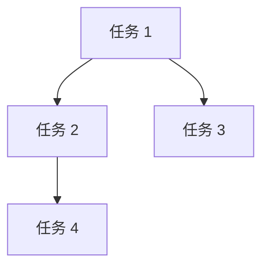

# Sprint N Planning: <标题>

## 📅 基本信息

*   **Sprint 编号**: N
*   **计划周期**: YYYY-MM-DD ~ YYYY-MM-DD
*   **参与人员**: @成员1, @成员2, @成员3
*   **里程碑**: Mx.y

## 🎯 Sprint Goal

<一句话描述本 Sprint 的核心目标>

### 成功标准

*   [ ] <可衡量的成功标准 1>
*   [ ] <可衡量的成功标准 2>
*   [ ] <可衡量的成功标准 3>

## 📊 容量评估

### 团队可用工时

| 成员 | 可用天数 | 请假/会议 | 实际可用 (人日) |
|------|---------|----------|----------------|
| @成员1 | 10 | 1 | 9 |
| @成员2 | 10 | 0.5 | 9.5 |
| @成员3 | 10 | 2 | 8 |
| **总计** | **30** | **3.5** | **26.5** |

### 历史速率参考

*   **上一 Sprint**: 完成 X 个任务, Y 人日
*   **平均速率**: Z 人日/任务
*   **建议容量**: 本 Sprint 建议安排 W 个任务

## 📦 任务列表

### P0 任务 (必须完成)

- [ ] **任务 1** (预估: X 人日)
    - 描述: <任务描述>
    - 负责人: @成员1
    - 依赖: 无
    - 风险: <潜在风险>

- [ ] **任务 2** (预估: X 人日)
    - 描述: <任务描述>
    - 负责人: @成员2
    - 依赖: 任务 1
    - 风险: <潜在风险>

### P1 任务 (尽力完成)

- [ ] **任务 3** (预估: X 人日)
    - 描述: <任务描述>
    - 负责人: @成员3
    - 依赖: 无
    - 风险: <潜在风险>

### P2 任务 (缓冲任务)

- [ ] **任务 4** (预估: X 人日)
    - 描述: <任务描述>
    - 负责人: 待分配
    - 依赖: 无
    - 风险: <潜在风险>

## 🔗 任务依赖关系

## ⚠️ 风险评估

### 高风险任务

1.  **任务 X**: <任务名称>
    *   **风险**: <风险描述>
    *   **影响**: <如果失败的影响>
    *   **缓解措施**: <如何降低风险>

### 外部依赖

1.  **依赖 X**: <依赖描述>
    *   **负责方**: <谁负责>
    *   **预计完成时间**: YYYY-MM-DD
    *   **备选方案**: <如果延期怎么办>

## 📋 Definition of Done (DoD)

每个任务完成时必须满足:

*   [ ] 代码已提交并通过 Code Review
*   [ ] 单元测试覆盖率 > 80%
*   [ ] 文档已更新 (PRD/Tech Design)
*   [ ] 功能已演示并获得确认
*   [ ] 无 Critical Bug

## 🎬 Sprint 启动检查清单

*   [ ] **里程碑对齐**: 确认任务与长期里程碑一致
*   [ ] **Backlog 整理**: 确认所有任务已细化
*   [ ] **容量确认**: 确认团队工时合理
*   [ ] **依赖确认**: 确认外部依赖已协调
*   [ ] **工具准备**: 确认开发环境就绪

## 📝 相关文档

*   **Backlog**: [backlog.md](../product/backlog.md)
*   **Milestones**: [milestones.md](../product/milestones.md)
*   **上一 Sprint 总结**: [sprint_N-1_summary.md](sprint_N-1_summary.md)
*   **Kanban**: [kanban.md](../../kanban.md)
