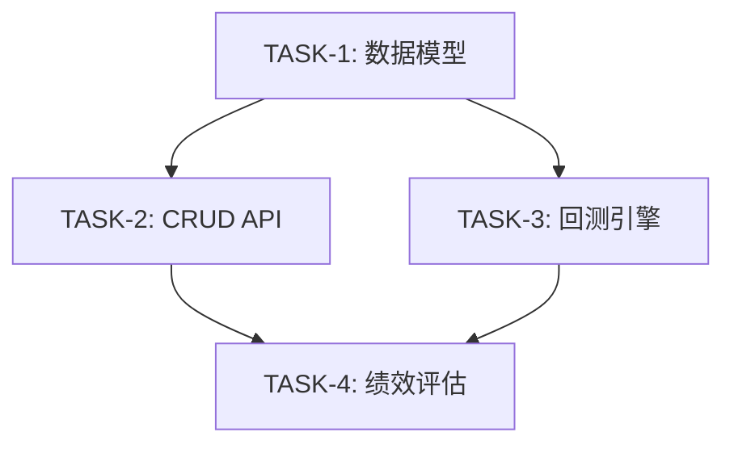

# 任务模板 (Task Template)

本模板定义了 Sprint 中任务的标准化格式，确保任务描述清晰、可执行、可追踪。

## 📋 任务卡片模板

### 基础模板

```markdown
#### TASK-{N}: {任务标题} ({优先级})

**说明**: {任务的详细描述，说明要做什么、为什么要做}

**依赖**: {依赖的前置任务，如 TASK-1, TASK-2；无依赖则填"无"}

**子任务**:
- [ ] {子任务 1}
- [ ] {子任务 2}
- [ ] {子任务 3}

**交付产物**: {任务完成后补充}
```

> 💡 **提示**: 如果任务创建时已明确交付产物，可使用表格格式：
> ```markdown
> **交付产物**:
> | 产物 | 路径 | 说明 |
> | ---- | ---- | ---- |
> | {产物名称} | `{path/to/file}` | {简要说明} |
> ```

### 完整模板 (复杂任务)

```markdown
#### TASK-{N}: {任务标题} ({优先级})

**说明**: {任务的详细描述，说明要做什么、为什么要做}

**依赖**: {依赖的前置任务，如 TASK-1, TASK-2；无依赖则填"无"}

**验收标准**:
- {验收标准 1}
- {验收标准 2}
- {验收标准 3}

**子任务**:
- [ ] {子任务 1} `{复杂度}`
- [ ] {子任务 2} `{复杂度}` `依赖:{子任务ID}`
- [ ] {子任务 3} `{复杂度}`

**交付产物**:
| 产物 | 路径 | 说明 |
| ---- | ---- | ---- |
| {产物名称} | `{path/to/file}` | {简要说明} |

**风险与注意事项**:
- {风险 1}
- {注意事项 1}
```

---

## 📝 字段说明

### 必填字段

| 字段 | 说明 | 示例 |
| ---- | ---- | ---- |
| **TASK-N** | 任务唯一编号 | `TASK-1`, `TASK-2` |
| **任务标题** | 简洁描述任务内容 | `策略数据模型设计` |
| **优先级** | P0/P1/P2 | `(P0)` 最高优先级 |
| **说明** | 任务详细描述 | 设计策略模块的核心数据模型... |
| **交付产物** | 任务完成后的输出 | 代码文件、文档、配置等 |

> ⚠️ **重要**: 交付产物可以在任务创建时不明确，**任务执行结束后补充**。这是因为：
> - 探索性任务的产出在执行前难以预测
> - 实际开发中可能产生计划外的有价值产出
> - 避免过度设计，保持敏捷

### 可选字段

| 字段 | 说明 | 何时使用 |
| ---- | ---- | -------- |
| **依赖** | 前置任务 | 任务有依赖关系时 |
| **子任务** | 任务拆分 | 任务较复杂时 |
| **验收标准** | 完成定义 | 需要明确验收条件时 |
| **风险与注意事项** | 潜在问题 | 任务有风险时 |

---

## 🏷️ 优先级定义

| 优先级 | 含义 | 说明 |
| ------ | ---- | ---- |
| **P0** | 必须完成 | Sprint 核心目标，阻塞其他任务 |
| **P1** | 应该完成 | 重要但不阻塞核心目标 |
| **P2** | 可以延期 | 优化类任务，可推迟到下个 Sprint |

---

## 🎯 复杂度标签

| 标签 | 含义 | 参考范围 |
| ---- | ---- | -------- |
| `🟢低` | 简单任务 | 1-2 小时，熟悉的技术栈 |
| `🟡中` | 中等任务 | 半天到一天，需要一定设计 |
| `🔴高` | 复杂任务 | 多天，涉及新技术或复杂逻辑 |

---

## 📦 交付产物类型

### 代码类

| 类型 | 路径模式 | 说明 |
| ---- | -------- | ---- |
| 数据模型 | `backend/app/models/*.py` | SQLAlchemy 模型 |
| API 端点 | `backend/app/api/v1/endpoints/*.py` | FastAPI 路由 |
| 业务服务 | `backend/app/services/*.py` | 业务逻辑层 |
| 数据仓库 | `backend/app/repositories/*.py` | 数据访问层 |
| Schema | `backend/app/schemas/*.py` | Pydantic 模式 |
| 前端页面 | `frontend/src/pages/*.tsx` | React 页面组件 |
| 前端组件 | `frontend/src/components/*.tsx` | React 通用组件 |
| 前端服务 | `frontend/src/services/*.ts` | API 调用层 |

### 测试类

| 类型 | 路径模式 | 说明 |
| ---- | -------- | ---- |
| 单元测试 | `backend/tests/test_*.py` | pytest 测试 |
| 组件测试 | `frontend/src/**/*.test.tsx` | Vitest 测试 |
| E2E 测试 | `frontend/e2e/*.spec.ts` | Playwright 测试 |

### 文档类

| 类型 | 路径模式 | 说明 |
| ---- | -------- | ---- |
| 技术文档 | `docs/tech/*.md` | 架构、设计文档 |
| 产品文档 | `docs/product/*.md` | PRD、用户故事 |
| Sprint 总结 | `docs/sprints/sprint-*-summary.md` | Sprint 归档 |

---

## 🔗 依赖关系表示

### 任务级依赖

```markdown
**依赖**: TASK-1, TASK-2
```

### 子任务级依赖

```markdown
- [ ] 子任务 A `🟢低`
- [ ] 子任务 B `🟡中` `依赖:子任务A`
- [ ] 子任务 C `🟢低` `依赖:TASK-1`
```

### 依赖关系图 (可选)



---

## ✅ 任务状态流转

```
[ ] 待开始 (Pending)
    ↓
[🔄] 进行中 (In Progress)
    ↓
[x] 已完成 (Completed)
```

### 状态标记

| 状态 | Markdown | 说明 |
| ---- | -------- | ---- |
| 待开始 | `- [ ]` | 尚未开始 |
| 进行中 | `- [🔄]` 或 `- [ ] 🔄` | 正在进行 |
| 已完成 | `- [x]` | 已完成并验收 |
| 阻塞 | `- [ ] ⚠️` | 被阻塞，需要处理 |

---

## 📋 完整示例

### 示例 1: 简单任务

```markdown
#### TASK-1: 用户登录 API (P0)

**说明**: 实现用户登录接口，支持邮箱密码登录，返回 JWT Token

**依赖**: 无

**子任务**:
- [ ] 实现登录端点
- [ ] 添加密码验证
- [ ] 生成 JWT Token
- [ ] 编写单元测试

**交付产物**:
| 产物 | 路径 | 说明 |
| ---- | ---- | ---- |
| 登录 API | `backend/app/api/v1/endpoints/auth.py` | 登录端点 |
| 测试 | `backend/tests/test_auth.py` | 登录测试 |
```

### 示例 2: 复杂任务

```markdown
#### TASK-3: 回测引擎核心 (P0)

**说明**: 实现事件驱动的回测引擎，支持历史数据回测和订单模拟执行

**依赖**: TASK-1, TASK-2

**验收标准**:
- 支持单股票回测
- 支持多股票组合回测
- 回测结果包含完整的交易记录
- 性能: 1年日线数据回测 < 5秒

**子任务**:
- [ ] BacktestEngine 核心类 `🔴高`
- [ ] 事件系统 (MarketEvent, SignalEvent, OrderEvent, FillEvent) `🟡中`
- [ ] 数据处理器 (DataHandler) `🟡中` `依赖:事件系统`
- [ ] 策略执行器 (StrategyExecutor) `🟡中` `依赖:事件系统`
- [ ] 订单模拟器 (SimulatedBroker) `🟡中` `依赖:事件系统`
- [ ] 持仓管理器 (PositionManager) `🟢低` `依赖:订单模拟器`

**交付产物**:
| 产物 | 路径 | 说明 |
| ---- | ---- | ---- |
| 回测引擎 | `backend/app/services/backtest_engine.py` | 核心回测逻辑 |
| 事件系统 | `backend/app/services/backtest_events.py` | 事件定义 |
| 模拟券商 | `backend/app/services/simulated_broker.py` | 订单执行模拟 |
| 测试 | `backend/tests/test_backtest.py` | 回测引擎测试 |

**风险与注意事项**:
- 事件循环性能可能成为瓶颈，需要优化
- 订单撮合逻辑需要考虑滑点和手续费
```

---

## 🔄 任务生命周期

1. **创建**: 在 Sprint 规划时创建任务卡片
2. **细化**: 补充子任务、依赖关系、交付产物
3. **执行**: 标记进行中，逐步完成子任务
4. **验收**: 确认交付产物，标记完成
5. **归档**: Sprint 结束时移入 Summary 文档
